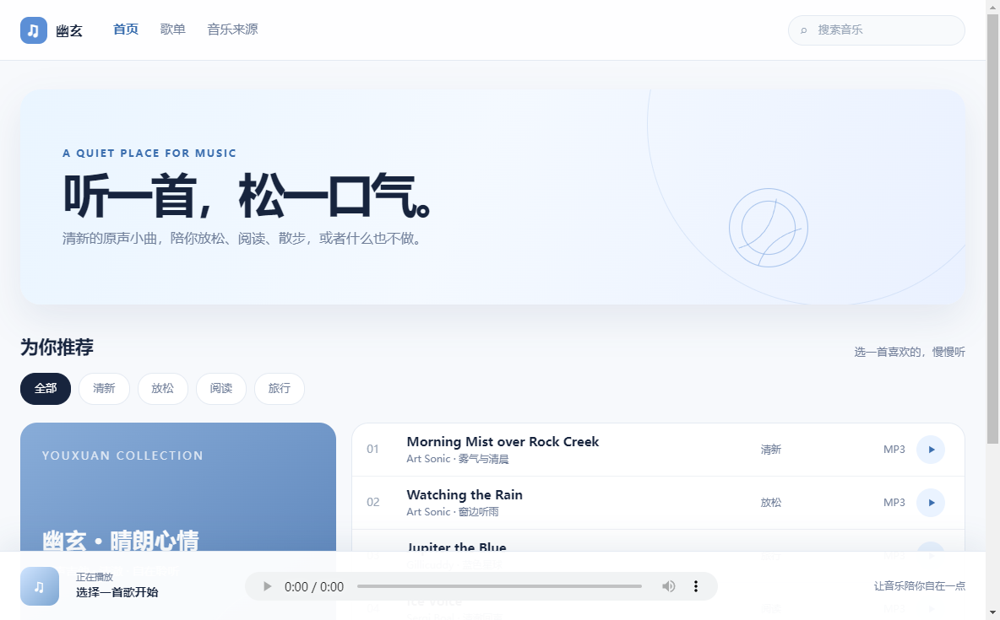

# 幽玄 / Youxuan Music

幽玄是一个蓝调清新风格的轻音乐项目，包含在线网页版本和 Windows 桌面客户端。两种版本共享同一组 Creative Commons 原声吉他音乐，但使用场景不同：网页端适合直接分享网址，客户端适合离线播放。

## 网页版本



进入 [web](web/) 目录即可看到网页文件。在线使用时打开部署网址；本地预览可以直接打开 `web/index.html`，或者用任意静态文件服务器托管 `web/` 目录。

操作步骤：

1. 打开网页。
2. 在推荐列表选择一首歌。
3. 点击歌曲右侧的播放按钮。
4. 使用底部播放器暂停、拖动进度或调节音量。

## Windows 客户端


进入 [client](client/) 目录。开发运行需要 Node.js：

```bash
npm install
npm start
```

构建 Windows 客户端目录：

```bash
npm exec electron-builder -- --win dir
```

发布包需要完整解压，然后双击解压目录中的 `幽玄.exe`。不要只复制单独的 exe 文件，Electron 运行还需要同目录的资源文件。

客户端操作步骤：

1. 启动 `幽玄.exe`。
2. 在左侧按放松、阅读或旅行筛选歌曲。
3. 点击歌曲行右侧的播放按钮。
4. 使用底部播放器控制播放进度和音量。

## 音乐授权

音乐来自 Internet Archive，并按各曲目的 Creative Commons 许可证使用。完整作者、来源和许可证链接见 [web/ATTRIBUTION.txt](web/ATTRIBUTION.txt) 和 [client/ATTRIBUTION.txt](client/ATTRIBUTION.txt)。曲目包含非商业、署名、禁止改编或相同方式共享等条件，请保留授权文件并遵守对应许可证。
