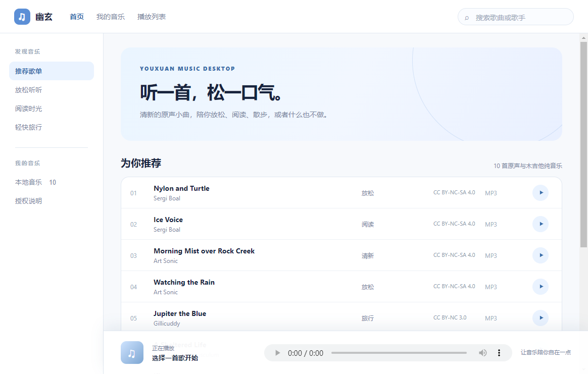

# 幽玄

幽玄（Youxuan）是一款蓝调清新风格的 Windows 本地音乐播放器，适合在阅读、休息或散步时安静听歌。



## 功能

- 10 首本地原声与木吉他纯音乐
- 按放松、阅读、旅行等氛围分类
- 歌曲与歌手搜索
- 播放、暂停、进度与音量控制
- 完全离线播放
- Windows 桌面客户端

## 使用

下载发布页中的 Windows 压缩包并完整解压，然后双击文件夹里的 `幽玄.exe`。

请勿只复制 `.exe` 文件。程序需要与同目录下的 `resources` 等运行文件一起使用。

## 本地开发

```bash
npm install
npm start
```

构建 Windows 客户端目录：

```bash
npm exec electron-builder -- --win dir
```

## 项目结构

```text
audio/           本地音乐文件
docs/            README 页面截图
index.html       播放器界面与交互
main.js          Electron 主进程
ATTRIBUTION.txt  音乐来源与授权信息
```

## 音乐授权

项目内音乐来自 Internet Archive，并按各自的 Creative Commons 许可证使用。曲目包含 `BY`、`NC`、`ND` 与 `SA` 条款，完整作者、来源和许可证链接见 [ATTRIBUTION.txt](ATTRIBUTION.txt)。

本项目及所含音乐仅用于非商业用途。将仓库或发行包上传到 GitHub 前，请保留 `ATTRIBUTION.txt`，并确认音乐文件的再分发方式符合各曲目的许可证要求。
